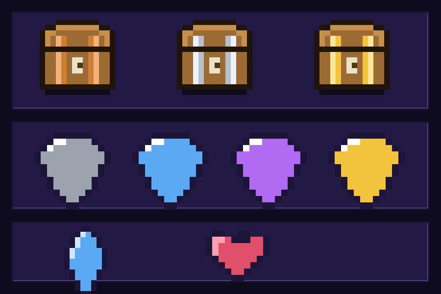
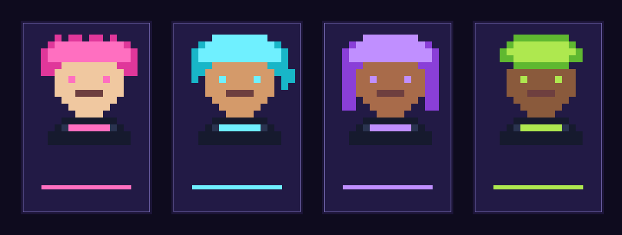
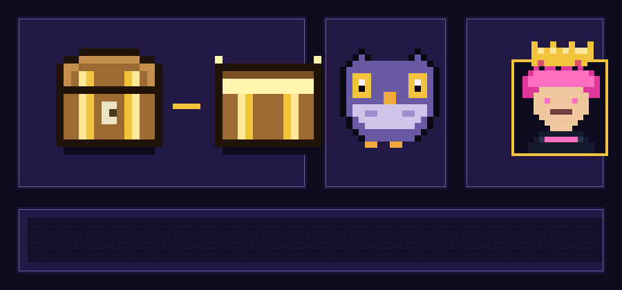
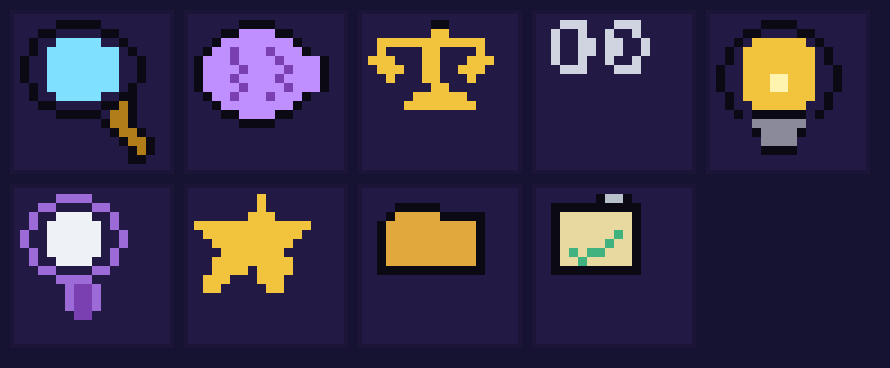

# Art Bible — "El Liceo de los Filósofos" (pixel-art / mazmorra)

Dirección de arte de la app móvil. Estilo: **RPG de mazmorra tipo Zelda**, pixel-art
con marcos de piedra, oro y pergamino. Todo está **implementado en código** (no son
mockups): fuentes pixel reales, paleta en `tailwind.config.js`, sprites SVG dibujados
a mano y componentes reutilizables.

## 1. Paleta (en `tailwind.config.js` y `src/theme/pixel.ts`)

| Rol | Hex | Uso |
|---|---|---|
| dungeon-950 | `#0e0b1e` | Fondo profundo de pantalla |
| dungeon-800/700 | `#221a45` / `#2e2458` | Cara de paneles |
| stone-light / dark | `#6b5fa3` / `#1c1538` | Bisel del marco (luz / sombra) |
| gold / light / dark | `#f2c33d` / `#ffe79a` / `#b07d18` | Acentos, botones, XP |
| parchment | `#e8d9a0` | Texto principal sobre madera/piedra |
| arcane | `#9d6bd8` | Texto secundario |
| ruby / emerald | `#e0506a` / `#3fb27f` | Peligro / éxito |
| rareza | gris/azul/morado/oro | Común·Raro·Épico·Legendario |

## 2. Tipografía

- **Titulares y números:** `Press Start 2P` (clase `font-pixel`) — chunky, en MAYÚSCULAS, con `letterSpacing`.
- **Etiquetas y UI:** `Silkscreen` (clase `font-body`) — pixel legible.
- **Texto largo** (definiciones, descripciones de clase): se mantiene en `font-body`
  a tamaño cómodo para preservar legibilidad a los 17-18 años.

Cargadas en `app/_layout.tsx` con `expo-font` + splash gestionado.

## 3. Componentes del sistema

- **`PixelPanel`** (`src/components/pixel/`): caja con marco de piedra biselado
  (luz arriba/izq, sombra abajo/der) + **sombra dura** sin blur. Variante `rivets`
  añade remaches dorados en las esquinas. Tonos: `stone`, `gold`, `arcane`.
- **`Button`** (`src/components/ui/`): botón 3D con bisel y efecto **hundido** al
  presionar (se mueve 4px). Variantes `primary` (oro), `ghost` (piedra), `danger` (rubí).
- **`PixelSprite`**: renderiza cualquier sprite desde una grilla de texto (1 char = 1 píxel)
  con `react-native-svg`. Soporta `tint` para recolorear (p. ej. gemas por rareza).
- **`XPBar`**: barra segmentada con marco de piedra y relleno dorado animado.

## 4. Sprites (en `src/components/pixel/sprites.ts`)

Dibujados como grillas de caracteres → fáciles de editar pixel a pixel.

| Sprite | Grilla | Notas |
|---|---|---|
| Cofre | 16×14 | 3 variantes metálicas: bronce / plata / oro |
| Gema | 12×12 | Tintable; se usa para artefactos según rareza |
| Cristal XP | 10×13 | Acento de experiencia |
| Corazón | 10×8 | Reserva para vidas/participación |

**Cómo agregar un sprite nuevo:** define una grilla (filas del mismo ancho, `.`=transparente)
y una `palette` `{char: '#hex'}`, expórtala como `SpriteDef` y úsala con
`<PixelSprite sprite={MI_SPRITE} size={…} />`. Regenera la preview con
`node scripts/preview-sprites.js docs/design/sprites-preview.png`.

## 5. Pantallas reskininadas

Login, Perfil, Aventura (mapa), Actividades (bitácora), Ranking (salón de héroes),
Mochila/Grimorio, y todo el panel del Game Master (panel, héroes, registrar hazaña),
además del modal de apertura de cofre.

## 5.b Avatares de héroe (✅ implementado)

4 personajes pixel **futuristas con pelo teñido** (neón) que el estudiante elige
(`src/components/pixel/avatars.ts`):

| ID | Nombre | Peinado | Pelo | Piel |
|---|---|---|---|---|
| `nova` | Nova | Cresta | Rosa neón | Clara |
| `zeph` | Zeph | Flequillo | Cian eléctrico | Media |
| `lux` | Lux | Melena | Violeta | Tostada |
| `vex` | Vex | Undercut | Lima | Oscura |

Construcción por capas: una **cara/cuello base** (traje con visera y trim de neón,
ojos neón) + 4 **peinados** que se combinan; cada avatar redefine pelo, ojos, trim y
tono de piel. Selección con `AvatarPicker` (en el perfil del estudiante y al crear
héroe desde el GM). Aparece en perfil, ranking y lista de héroes. Persistido en
`Estudiante.avatar`. Para añadir más: agrega un peinado y una entrada a `AVATARS`.

## 5.c Piezas estéticas adicionales (✅ implementado)

- **Cofre animado**: `chestSprite` (cerrado) → `chestOpenSprite` (tapa arriba +
  resplandor) intercambiados por fase en `ChestOpening` (idle/shake → cerrado,
  burst/reveal → abierto).
- **Lechuza de Atenea** (`OWL_SPRITE`): mascota; aparece en el splash. Reutilizable
  para tips/onboarding/estados vacíos.
- **Marco y corona por nivel** (`HeroAvatar`): el avatar lleva un marco cuyo color
  sube de tramo (piedra→bronce→plata→arcano→oro) y una **corona** desde el nivel 9.
- **Tile de fondo** (`assets/tile-dungeon.png`, 32×32 seamless, running-bond) repetido
  en `Screen` con `ImageBackground resizeMode="repeat"`.
- **Ícono, adaptive-icon y splash** generados (`assets/icon.png`, etc.) y conectados
  en `app.json`.

Todos los PNG se generan con scripts sin dependencias:
`node scripts/gen-assets.js` (assets de app) y los `scripts/preview-*.js` (previews).

## 5.d Íconos pixel (✅ implementado)

Definidos en `src/components/pixel/icons.json` (grilla + paleta, 16×16) y accesibles
con `skillIcon(id)` / `catIcon(id)` (`icons.ts`).

- **6 habilidades**: lupa (Análisis), cerebro (Crítico), balanza (Argumentación),
  eslabón (Síntesis), bombilla (Creatividad), espejo (Reflexión) → en la **leyenda del radar**.
- **3 categorías de actividad**: estrella (Cotidiana), carpeta (Proceso), portapapeles
  con visto (Evaluación) → en los **encabezados del registro** del GM.

Validados con `node scripts/preview-icons.js` (comprueba que cada ícono sea 16×16
y genera la hoja de contacto).

## 6. Próximos assets recomendados (opcionales, para más pulido)

1. **Íconos individuales** para cada uno de los 17 tipos de actividad (hoy usan el
   ícono de su categoría + emoji).
2. **Cofre con más frames** (2-3 intermedios) para una apertura aún más suave.
3. **Variantes de mascota** (lechuza guiñando / con birrete) para onboarding.
4. **Accesorios extra de avatar** por logros (gafas AR, aura animada).

> Pipeline: define la grilla en `sprites.ts`/`avatars.ts` (vectorial-pixel, escala
> nítida en SVG) o, para fondos/íconos de app, genera un PNG con el rasterizador de
> `scripts/`. Regenera previews con los `scripts/preview-*.js`.
